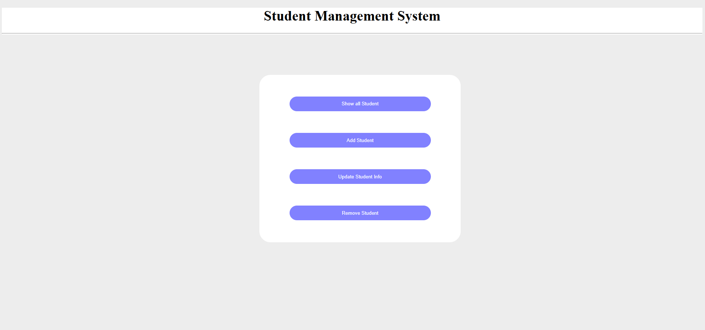
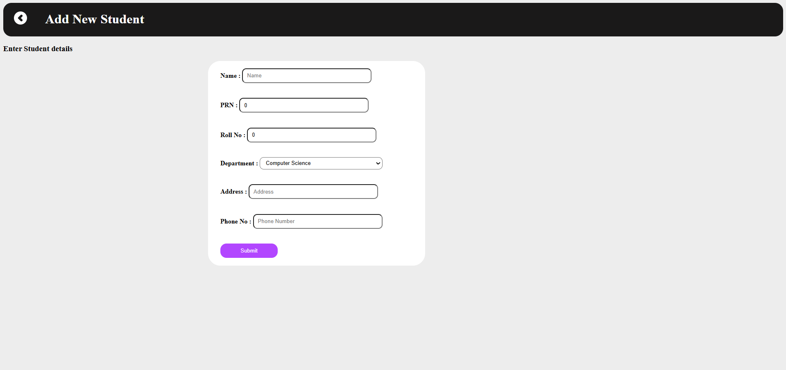
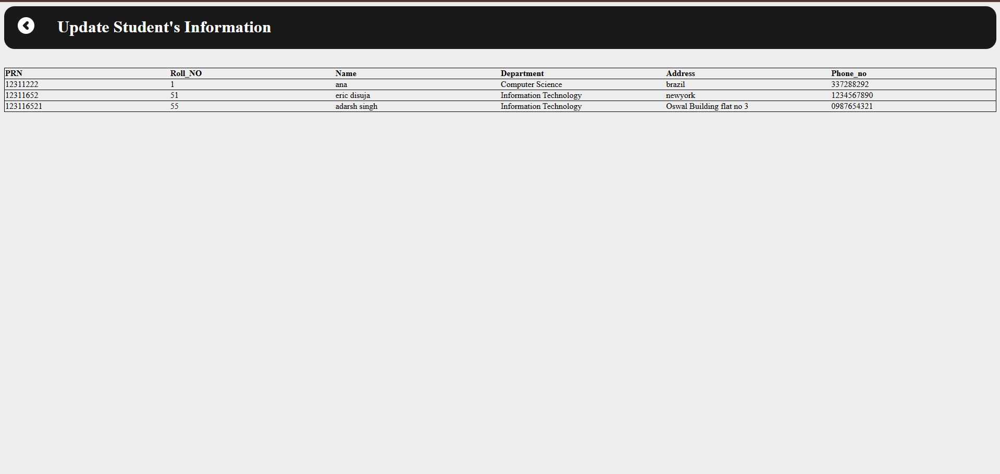
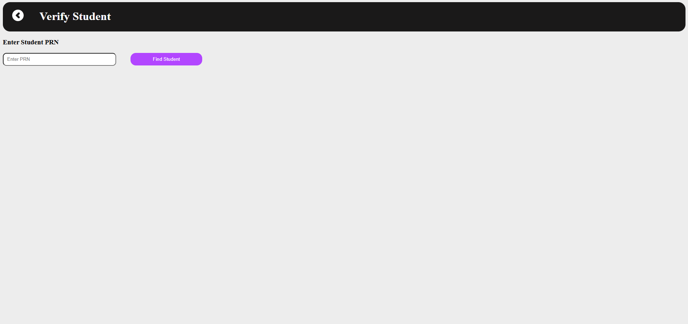
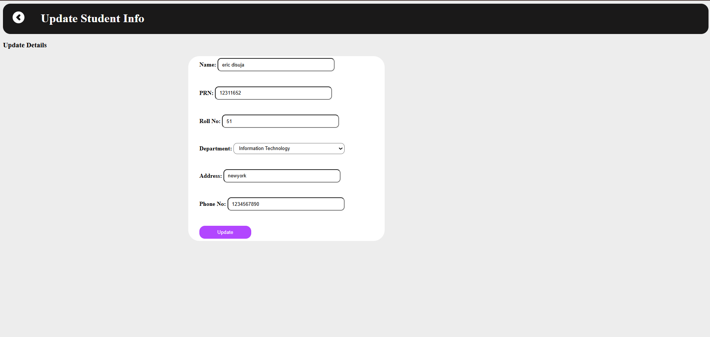
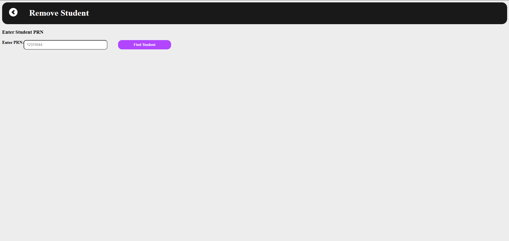

# 📚 Student Management System

## 💻 Project Overview

The **Student Management System** is a web application built using **Spring Boot**, **Thymeleaf**, **HTML**, **CSS**, **JavaScript**, and **Spring Data JPA (Hibernate)** for database management.
It provides a simple and user-friendly interface to **add**, **update**, **delete**, and **view** student information.

The application is connected to a **MySQL** database to persist student records and supports essential CRUD (Create, Read, Update, Delete) operations.

---

## ✨ Features

* ✅ Add New Student
  Add student information including **Name, PRN, Roll Number, Department, Address, and Phone Number.**

* ✅ View All Students
  Display all student records in a clean tabular format.

* ✅ Update Student Information
  Search students by **PRN** and update their details quickly.

* ✅ Remove Student
  Delete any student’s record from the system.

* ✅ Responsive UI
  A simple and interactive frontend built using **HTML, CSS, JavaScript**, and **Thymeleaf templates.**

---

## 🛠️ Technologies Used

* **Spring Boot**
* **Spring Data JPA (Hibernate)**
* **Thymeleaf**
* **HTML, CSS, JavaScript**
* **MySQL Database**

---

## ⚙️ Requirements

* Java 8 or above
* MySQL Database
* Maven
* Spring Boot (2.x or above)

---

## 🚀 Getting Started

1. **Clone the Repository**

   ```bash
   git clone <repository-url>
   ```

2. **Set up the MySQL Database**

   * Create a database (example: `studentdb`).
   * Configure your database connection in `application.properties`.

3. **Build and Run the Project**

   ```bash
   mvn clean install
   mvn spring-boot:run
   ```

4. **Access the Application**

   * Open your browser and go to:
     `http://localhost:8080`

---

## 📂 Project Structure

* `src/main/java` - Spring Boot Application and Controllers
* `src/main/resources/templates` - Thymeleaf HTML Pages
* `src/main/resources/static` - CSS, JavaScript, and Images
* `src/main/resources/application.properties` - Database Configuration

---

## 📌 Notes

* All student records are uniquely identified by their **PRN**.
* Validation is recommended for phone numbers and department names in future improvements.

---

## 🙌 Acknowledgements

This project was developed as part of a **student learning exercise** to understand:

* Spring Boot CRUD Operations
* Frontend-Backend Integration
* Database Handling with Hibernate and MySQL
* REST API Design

---


# 📸 Screenshots

## 1. Home Page (Dashboard)


The Home Page provides quick access to all functionalities like **View All Students, Add Student, Update Student, and Remove Student** through easy-to-use navigation buttons and widgets.

---

## 2. Add Student Page


On this page, you can **add new student records** by entering the student's name, PRN, roll number, department, phone number, and address. After submission, the student will be added to the database.

---

## 3. View All Students Page


This page displays a **table of all students currently in the system.** You can see all student details like PRN, roll number, name, department, address, and phone number.

---

## 4. Update Student - PRN Search


Here, you can **search for a student by entering their PRN.** The system will retrieve their current details for editing.

---

## 5. Update Student - Edit Form


Once a student is found, you can **update their information** like name, roll number, department, address, and phone number. After updating, changes will be reflected in the database.

---

## 6. Remove Student Page


This page allows you to **remove a student record** by entering their PRN. Once removed, the student will no longer appear in the student list.

---
